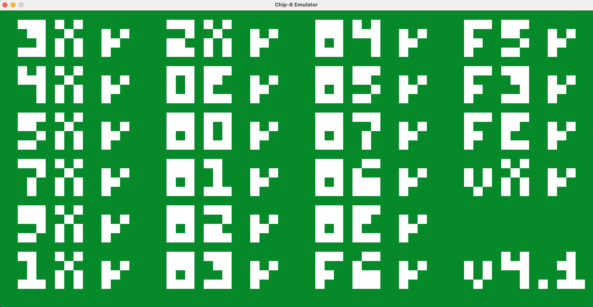
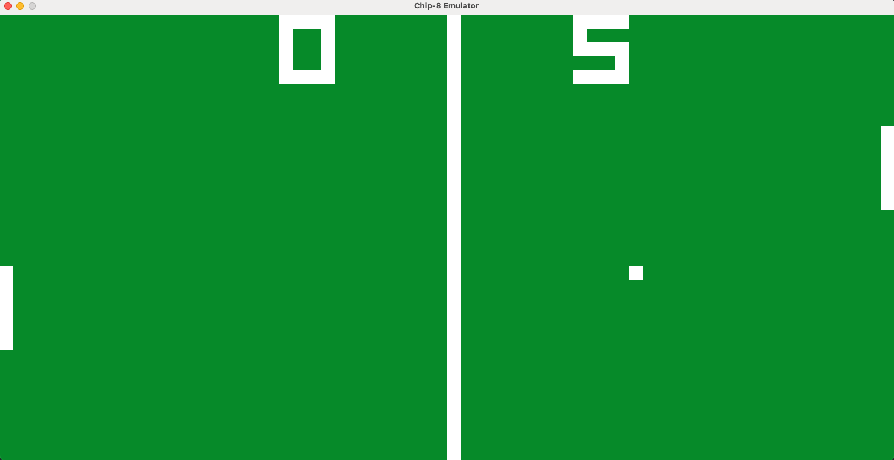

# CHIP-8 Emulator 

This is my initial dive into Rust and emulator development and represents an implementation of the popular CHIP-8 interpreter, commonly used as a beginner  
guide into emulator development because of it's relative simplicity.  

The current implementation covers the initial specification of the CHIP-8 (34 opcodes excluding the `0NNN` opcode) that can be found here: [CHIP-8 Instruction Set](https://github.com/mattmikolay/chip-8/wiki/CHIP%E2%80%908-Instruction-Set)

# Screenshots

CHIP-8 Test Suite            |  PONG2
:-------------------------:|:-------------------------:
    |     

# Building
```cargo build```

# Running
```cargo run <rom_path>```

# Key bindings

|                         |                         |
| ----------------------- | ----------------------- |
       Keyboard           =>          CHIP-8 

    | 1 | 2 | 3 | 4 |     |      | 1 | 2 | 3 | C |  
    | Q | W | E | R |     |      | 4 | 5 | 6 | D |   
    | A | S | D | F |     |      | 7 | 8 | 9 | E |  
    | Z | X | C | V |     |      | A | 0 | B | F |   
                 

## Shortcuts

| Key      | Action |
| ----------- | ----------- |
| Escape      | Quit emulator       |
| Ctrl + Backspace   | Reset emulator        |
| P   | Pause emulator        |

# Testing the emulator

Timendus's CHIP-8 Test Suite: [https://github.com/Timendus/chip8-test-suite](https://github.com/Timendus/chip8-test-suite).  

Highly recommended for testing the opcode implementation and different quirks.

# Future improvements
*  Add support for SUPER-CHIP 8  
*  Add more quirk implementations  
*  Dialog based ROM selection  